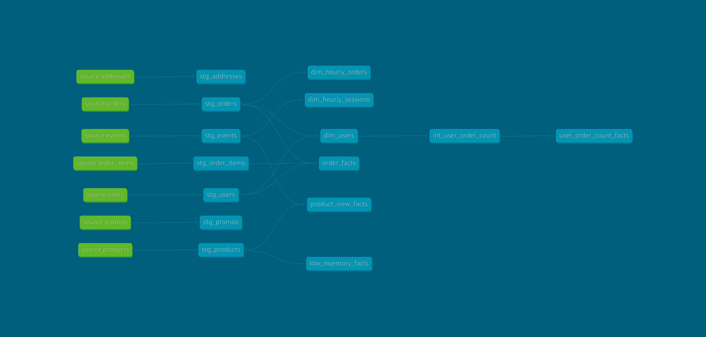

# Chris's co:rise dbt project

## Assignments

### Week 3

Session conversion rate:
```sql
select sum(checkout)::float / count(*) as conversion_rate
from dbt_chris_r_reporting.dim_sessions
```
0.6245674740484429

Product conversion rate:
```sql
select name, round(conversion_percent::decimal,1)
from dbt_chris_r.product_view_facts as conversion_percent
order by name
```

Name | Conversion (%)
--- | ---
Alocasia Polly | 38.9
Aloe Vera | 49.2
Angel Wings Begonia | 38.7
Arrow Head | 54.7
Bamboo | 52.2
Bird of Paradise | 45.0
Birds Nest Fern | 41.3
Boston Fern | 41.3
Cactus | 54.5
Calathea Makoyana | 50.9
Devil's Ivy | 48.9
Dragon Tree | 46.8
Ficus | 42.6
Fiddle Leaf Fig | 47.5
Jade Plant | 47.8
Majesty Palm | 47.8
Money Tree | 46.4
Monstera | 51.0
Orchid | 45.3
Peace Lily | 40.3
Philodendron | 47.6
Pilea Peperomioides | 45.2
Pink Anthurium | 41.9
Ponytail Palm | 39.4
Pothos | 32.8
Rubber Plant | 50.0
Snake Plant | 39.7
Spider Plant | 47.5
String of pearls | 60.0
ZZ Plant | 52.3

### Week 2

Repeat user rate:
```sql
select percent_with_n_or_more_orders 
from dbt_chris_r.user_order_count_facts
where order_count=2
```
Answer: 79.84%

Who is unlikely to order again:
* Users with only one order
* Users with a long time since their last purchase. This is tracked in the users fact Mart.

Added models:
* `core/dim_hourly_orders` to track how many orders in each hour and what ratio have been fulfilled.
* `core/dim_hourly_sessions` to track how many sessions per hour to assess load on infrasturcure
* `core/dim_users` tracking last order, total revenue, promo use.
* `marketing/order_facts` to answer marketing questions and merge in how many items ordered.
* `marketing/user_order_count_facts` to answer the specific marketing assignment question.
* `product/low_inventory_facts` to see what inventory needs to be re-ordered.
* `product/product_view_facts` to see what products are viewed often and the time since the last view.

Tests were added to certify uniqueness of columns and that data wasn't missing from critical columns.
**I don't know how to ensure that the tests are passing regularly. If you know, please comment in the review.**



Reflection questions in Slack submission post.

### Week 1

* How many users do we have:
  ```sql
  select count(distinct user_guid) from dbt_chris_r.stg_users
  ```
  * 130
* On average, how many orders do we receive per hour?
  ```sql
  select avg(order_count) from dbt_chris_r.hourly_orders
  ```
  * 7.5208333333333333
* On average, how long does an order take from being placed to being delivered?
  ```sql
  select avg(delivered_at_utc - created_at_utc) as avg_delivery_interval from dbt_chris_r.stg_orders
  ```
  * 3 days 21:24:11.803279
* How many users have only made one purchase? Two purchases? Three+ purchases?
  ```sql
  select count(*) from dbt_chris_r.user_purchase_count
  group by purchase_count having purchase_count=1
  ```
  * 25
  ```sql
  select count(*) from dbt_chris_r.user_purchase_count
  group by purchase_count having purchase_count=2
  ```
  * 28
  ```sql
  with cte as (
  select purchase_count, count(*) as user_count from dbt_chris_r.user_purchase_count
  group by purchase_count
  ) select sum(user_count) from cte where purchase_count >= 3
  ```
  * 71
* On average, how many unique sessions do we have per hour?
  ```sql
  with cte as (
    select date_trunc, count(*) as session_count from dbt_chris_r.hourly_sessions
    group by date_trunc
  )
  select avg(session_count) from cte
  ```
  * 11.7959183673469388